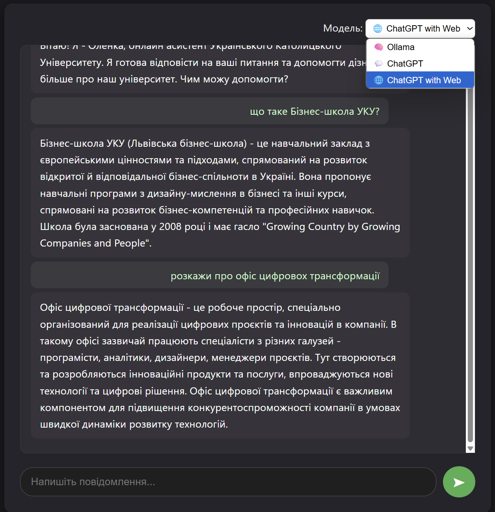

# 🤖 ChatBot Project — AI Assistant for University

This project is an intelligent chatbot built for a university setting using **FastAPI**, **Ollama**, **OpenAI**, with support for RAG-based search, web browsing, response streaming, and user session tracking.

---

## 🚀 Key Features

- 🧠 **LLM Support**:  
  - `🧠 Ollama` — local models (e.g., Mistral, Phi)
  - `💬 ChatGPT` — OpenAI with local RAG context
  - `🌐 ChatGPT with Web` — OpenAI with live search from the internet

- 🔍 **RAG Context Search**: FAISS + Sentence Transformers  
- 🌐 **Web Search (Google Custom Search)** for external information  
- 🧵 **Streaming Responses**: real-time text streaming  
- 🕒 **User Sessions**: automatic session tracking per LLM instance  
- 📨 **CRM Integration**: ticket creation based on user inquiries  
- 🎨 **Modern UI**: Microsoft Teams / iOS-style design, dark theme  

---

## 🗂 Project Structure

```
chatbot_project/
├── app/
│   ├── LLM/                    # LLM clients: Ollama, ChatGPT, ChatGPTWeb
│   ├── sessionDB/              # SQLAlchemy models and session logic
│   ├── utils/                  # RAG, prompts, streaming, web search
│   ├── templates/              # HTML templates (Jinja2)
│   ├── static/                 # CSS, JS, icons
├── documents/                  # RAG source files
├── .env.example                # Sample environment configuration
├── requirements.txt            # Python dependencies
├── Dockerfile                  # FastAPI Docker setup
├── docker-compose.yml          # FastAPI + Ollama services
├── main.py                     # Main FastAPI app
```

---

## ⚙️ Setup Instructions

### 🧰 1. Clone and configure

```bash
git clone https://github.com/your_username/chatbot_project.git
cd chatbot_project
cp .env.example .env
```

Set your OpenAI API key in `.env`.

---

### 🐋 2. Run with Docker

```bash
docker-compose up --build
```

📍 Web interface: [http://localhost:8000](http://localhost:8000)  
📍 Swagger API docs: [http://localhost:8000/docs](http://localhost:8000/docs)

---

### ☁️ 3. Deployment to Azure VM

```bash
# SSH into the VM
ssh -i your_key.pem azureuser@<your-vm-ip>

# Install Docker
sudo apt update
sudo apt install -y docker.io docker-compose
sudo usermod -aG docker $USER

# Copy the project
scp -r -i your_key.pem ./chatbot_project azureuser@<your-vm-ip>:~
cd chatbot_project
docker-compose up --build -d
```

---

## 🧠 .env Example

```dotenv
# LLM
MODEL_NAME=mistral
OPENAI_API_KEY=your_openai_key_here
OPENAI_MODEL=gpt-3.5-turbo

# URLs
LOCAL_OLLAMA_URL=http://host.docker.internal:11434
DOCKER_OLLAMA_URL=http://ollama:11434

# Google Search API (optional for ChatGPT with Web)
GOOGLE_API_KEY=your_google_api_key
GOOGLE_CX=your_custom_search_engine_id
```

---

## 🧪 UI Features

- 🔄 Switch between LLMs: Ollama, ChatGPT, ChatGPT+Web
- 🟢 Streamed responses
- 📨 Ticket submission forms
- 📱 Mobile-friendly design

---

## ✨ UI Preview



---

## 🔐 Security

- `.env` is excluded via `.gitignore`
- `.env.example` is provided for safe configuration sharing
- No secrets are committed to Git history

---

## 🔮 Roadmap

- [ ] User authentication
- [ ] Admin interface
- [ ] RAG sources from PDF/CSV/API
- [ ] Auto-closing sessions based on inactivity

---

MIT License © 2025
